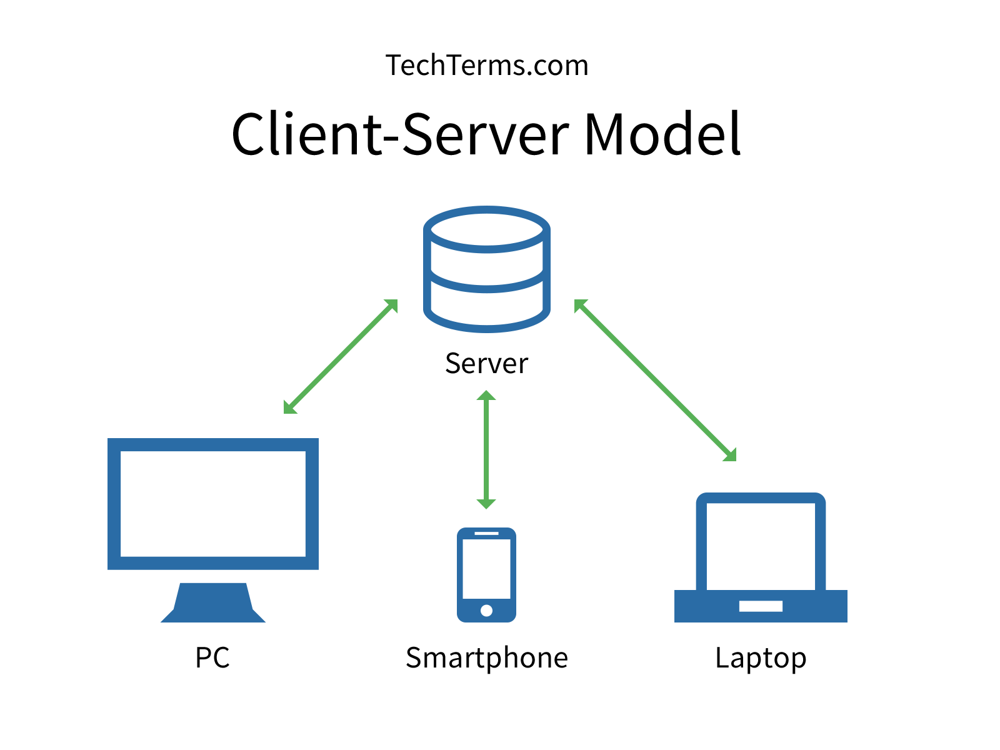
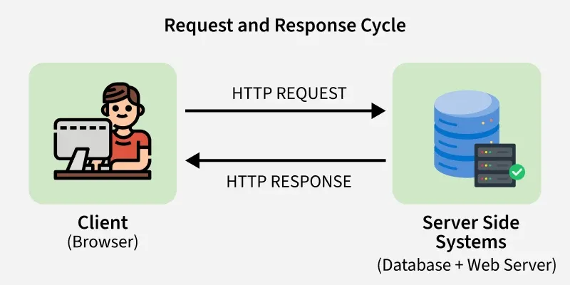

# Client-Server Architecture

---
## 1. The problem
Imagine every computer on the internet trying to communicate directly with every other computer.  

If you wanted to order an Uber, your phone would somehow need to know:

- where every driver is,
- who is available,
- how much they charge,
- their ratings,
- whether another passenger has already booked them.

I believe this would be chaotic. Do you agree? 
Every driver's phone would also need to constantly communicate with every passenger's phone.

Very quickly, this becomes impossible.

Problems include:
- No central source of truth.
- Data becomes inconsistent.
- Security becomes difficult because every device would expose its own data.
- Devices turning off would make information disappear.
- Finding other devices becomes extremely complicated.

As applications grew larger, developers needed a central computer that could store data, process requests, and coordinate communication between users.

This problem led to Client-Server Architecture.

---


## 2. The Solution
Instead of every device talking directly to every other device, introduce a central machine called a server.

This server becomes responsible for:
- storing data
- processing requests
- enforcing business rules
- authenticating users
- communicating with databases
- coordinating all clients

Clients become much simpler.

Their job is mostly to:
- display information
- collect user input
- send requests
- display responses

Every interaction flows through the server.



---

## 3. How it works
A client is any application used by the user.

Examples include:
- web browsers
- mobile apps
- desktop applications

A server is a computer that continuously listens for incoming requests.

The communication generally follows these steps.

---
### step 1
The client sends an HTTP request.

Example:
```
GET/profile

```
---

### Step 2
The server receives the request.

It determines:
- who sent it?
- Are they authenticated?
- What resource do they want?

---

### Step 3
The server performs work.

This could involve:
-querying the database
- performing calculations
- checking permissions
- calling another service

---

### Step 4
The server sends back a response.

Example:

```

{
    "name": "Mutsa",
    "role": "Software Engineer"
}

```
---
### Step 5
The client displays the information to the user.
The client does not decide whether the user has permissions.
The server always remains the authority.



---
## Stateless Communication

Most client-server systems are stateless.

This means:
Every request contains all the information needed to process it.

The server does not remember previous requests.

Example:

```
GET/orders
Authorization: Bearer eyJhb...

```
Tomorrow's request must include the token again.

This makes scaling much easier because any server can handle any request.
*(This idea becomes especially important when discussing load balancers later.)*

---
4. Real-World Example - Uber
Suppose you open Uber.
**Requesting nearby drivers **
Your phone sends:
```
GET/drivers?at=-26.20&lon=28.04
```
The server:
- validates your request
- queries nearby drivers
- filters unavailable drivers
- calculates ETA's
- sorts results

The server responds:
```
[
  {
    "name":"John",
    "eta":"3 min"
  },
  {
    "name":"Sarah",
    "eta":"5 min"
  }
]
```

Your phone simply displays the drivers.
It never decides who is available.

Only the server has the complete picture.

--- 
## Another Example - Netflix
When you open Netflix:
Your TV sends:

```
GET/homepage
```
The server:
- authenticates you
- fetches your watch history
- generates recommendations
- returns movie metadata

The client receives:
```
Continue Watching

Recommended

Trending

Top Picks

```

The recommendation algorithm never runs on your TV.

It runs on Netflix servers.


> ## 5. Advantages and trade-offs

---
### Advantages
**Centralized data**
- There is only one source of truth; everyone sees the same information

**Better security**
Sensitive logic remains on the server; passwords and business rules are never exposed to clients.

**Easier updates**
You update the server once. Millions of clients automatically use the updated logic.

**Scalability**
Servers can be upgraded or replicated to handle more users.

**Easier maintenance**
Developers can monitor logs, fix bugs, and deploy improvements centrally.

---
### Trade-offs

**Single point of failure**
If there is only one server and it crashes, then everyone loses access. This is why production systems use multiple servers.

**Network dependency**
Clients must communicate with the server.
Poor internet means poor user experience.

**Server bottleneck**
As users increase, one server eventually becomes overwhelmed.
This leads to concepts like:
- load balancing
- Horizontal scaling
- Caching
- CDNs

** Infrastructure cost**
Running servers continuously costs money.
Large companies operate thousands of servers worldwide.

---

## 6. Interview Questions

**What is Client-Server Architecture?**
A computing model where clients send requests to centralized servers that process those requests and return responses.

**What is a client?**
A client is the application used by the user, such as a browser, mobile app, or desktop application, that sends requests to a server and displays the responses.

**What is a server?**
A server is a computer or software application that listens for requests, processes them, accesses data when necessary, and returns responses to clients.

**Why don't clients communicate directly?**
Because a central server provides:

- consistency,
- security,
- easier maintenance,
- centralized data management,
- and coordination between users.

Direct communication becomes difficult to manage as systems grow.

**Is a server always a single computer?**
No. Logically, it acts as one server, but in production it often consists of many machines behind a load balancer. To the client, it still appears as a single server.

**Why is most business logic kept on the server?**
Because the server is trusted and controlled by the application owner. Keeping business logic on the server prevents users from bypassing rules, protects sensitive operations, and ensures all clients behave consistently.

---
### Key Takeaways
- Client-server architecture separates user interaction from application processing.
- Clients focus on presenting information and collecting input.
- Servers manage business logic, security, and data.
- Every request follows a request–response cycle.
- The server is the system's source of truth.
- This architecture is the foundation for almost every modern web and mobile application.


