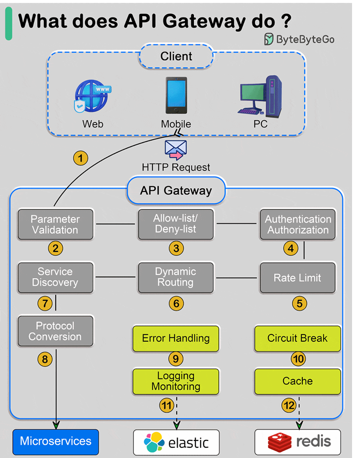

# API Gateway

## The Problem

Imagine your application started as a single backend service.

The frontend only needed to communicate with one API.

---

As the application grows, the backend is split into multiple services.

Now your React frontend may need to call:

- User Service
- Product Service
- Order Service
- Payment Service
- Notification Service.

---

The frontend suddenly becomes responsible for knowing:
- Which service provides which data
- The URL of every service
- Authentication for every request
- Rate limits
- Error handling
- Retry logic

---

This creates several problems.
- The frontend becomes tightly coupled to backend services.
- Service URLs may change.
- Authentication logic is duplicated.
- Rate limiting must be implemented everywhere.
- Clients may need to make many requests for one screen.
- Security rules become inconsistent.

---

Engineers needed a single entry point for all client requests.

That problem led to the API Gateway.

---

## What is an API Gateway?

An API Gateway is a server that sits between clients and backend services.

Clients send requests to the gateway.

The gateway then forwards those requests to the appropriate backend service.

Instead of the client communicating with many services directly, it communicates with one gateway.

---

## How an API Gateway Works

Suppose a mobile app requests a user's dashboard.

The API Gateway may:
- Authenticate the user.
- Call the User Service.
- Call the Order Service.
- Call the Notification Service.
- Combine the responses.
- Return a single response to the client.

---

The client makes one request.

The gateway handles the complexity.

--- 

### Without an API Gateway

Clients must know every backend service.

---

### With an API Gateway

The client only knows the gateway.

## What does an API Gateway Do?

**Common responsibilities:**

| Responsibility | Purpose |
-----------------|----------|
| Request Routing | Send requests to the correct service|
| Authentication | Verify user tokens |
|Authorization | Check permissions |
| Rate limiting | Prevent abuse |
| Request validation | Reject invalid requests|
| Response Aggregation | Combine data from multiple services|
| Caching | Cache common responses|
| Logging & Monitoring | Track API usage|
|SSL/TSL Termination | Handle HTTPS |
|API Versioning | Support multiple API versions |

---

**Real-World Example**

Imagine Netflix has these services:

- User service
- Streaming service
- Subscription service
- Notification service
- Recommendation service

A user profile screen may need data from several services.

Without an API Gateway, the frontend might make 5 separate requests.

With an API Gateway, the frontend makes one request.

The gateway gathers the data and returns a single response.

---

## API Gateway vs Reverse Proxy

|Reverse Proxy | API Gateway|
---------------|-------------|
| Routes requests | Routes requests|
|Hides backend services| hides backend services|
|May handle HTTPS| Handles HTTPS|
|May cache responses | may cache responses |
| Usually simple routing | Usually richer API logic |
| Not focused on authentication | Authentication & authorization |
| Not focused on rate limiting | Rate limiting|
| Not focused on aggregation | response aggregation |
|Good for web traffic routing | Good for microservices APIs |

> **Reverse Proxy** - Decides which backend server or service receives a request.
>
> 
> **Load Balancer** - Decides which server instance receives a request.
>
> 
> **API Gateway** - Decides which service receives a request and applies API-level policies.

## Popular API Gateway Tools

- Kong
- NGINX
- Traefik
- AWS API Gateway
- Apigee
- Azure API Management

## Key Takeaways

- An API Gateway is a single entry point for client requests.
- It routes requests to backend services.
- It centralizes authentication and authorization.
- It applies rate limiting.
- It can aggregate responses from multiple services.
- It simplifies frontend applications.
- It is especially useful in microservices architectures.

# Next Step

REST APIs

Because clients and services still need a standard way to structure requests and responses.
